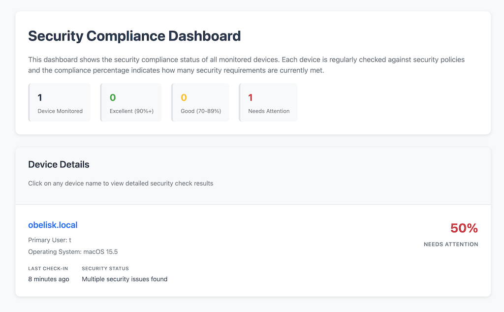
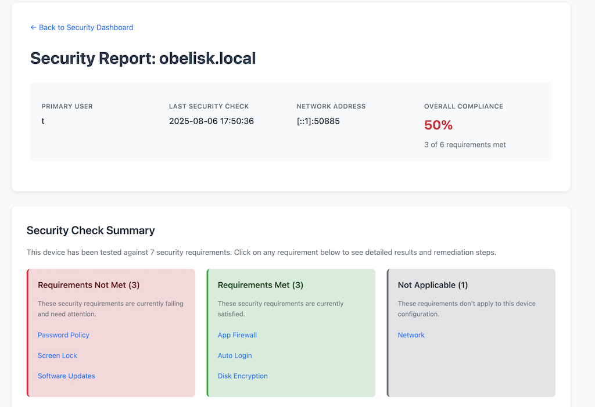
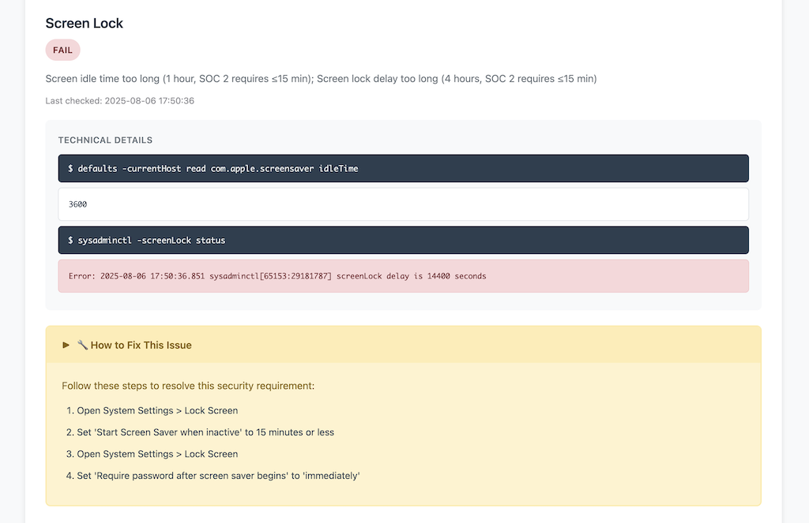

# gitMDM

Security-first compliance reporting that doesn't compromise your infrastructure.


## The Problem

Every MDM is a backdoor. They typically require root access and arbitrary remote code execution. They're incompatible with secure-by-default operating systems. Yet auditors require them for SOC 2.

## The Solution

gitMDM proves compliance without compromising security:
- **No arbitrary remote code execution** - Checks are compiled into the agent binary
- **No privileged access** - Runs as a normal user
- **No phone-home** - Your git repo, your endpoint, your control
- **Works everywhere** - Including secure-by-default systems such as OpenBSD.

## Screenshots

### Device List
<a href="media/dashboard.png"></a>

### Device Details

<a href="media/report.png"></a>

### Remediation
<a href="media/remediate.png"></a>

## How It Works

```
[Agent]                    [Server]                   [Git]
Run compiled checks  →  Receive reports only  → Tamper-resistant audit trail
```

The server **cannot** push commands. Ever. That's the point.

## Quick Start

```bash
# Server
./out/gitmdm-server -git git@github.com:org/compliance.git -api-key SECRET

# Agent
./out/gitmdm-agent -server https://server:8080
```

## Local Checks

You can run the compliance checks even without a server:

```bash
./out/gitmdm-agent -run all
```

You'll see output similar to:

```log
🔍 Running security checks...

⚠️  3 issues require attention

🔸 screen lock
   🐞 Problem: Screen idle time too long (1 hour, SOC 2 requires ≤15 min); Screen lock delay too long (4 hours, SOC 2 requires ≤15 min)
   💻 Evidence: defaults -currentHost read com.apple.screensaver idleTime && sysadminctl -screenLock status

   🔧 How to fix:
      1. Open System Settings > Lock Screen
      2. Set 'Start Screen Saver when inactive' to 15 minutes or less
      3. Open System Settings > Lock Screen
      4. Set 'Require password after screen saver begins' to 'immediately'
```

## What You Get

SOC 2 compliance evidence in git:
```
devices/laptop-alice/disk_encryption.json  ✓
devices/laptop-alice/screen_lock.json      ✓
devices/server-prod/firewall.json          ✓
```

Every check, every change, cryptographically signed and timestamped.

## Supported Platforms

Linux, macOS, Windows, FreeBSD, OpenBSD, NetBSD, DragonFlyBSD, Solaris, illumos

## checks.yaml

```yaml
checks:
  disk_encryption:
    openbsd: "bioctl softraid0 | grep -q CRYPTO"
    linux: "lsblk -o NAME,FSTYPE | grep -q crypto_LUKS"
    darwin: "fdesetup status | grep -q 'On'"
```

Edit, compile, deploy. No runtime configuration files to tamper with.

## Security Guarantees

- Server compromise = read-only access to compliance reports
- No arbitrary code execution, even with root on the server
- Agent decides what runs based on compiled-in checks
- Bash restricted mode when shell execution is needed

## Building

```bash
make all
```

## FAQ

**Q: Is this SOC 2 compliant?**
A: It generates the reports auditors need. Without the backdoors.

**Q: What if we need to change checks?**
A: Rebuild and redeploy. Immutability is a feature, not a bug.

**Q: Why git?**
A: Cryptographic proof, audit trail, existing tooling, no database.

---

*Built for organizations that refuse to compromise security for compliance.*
